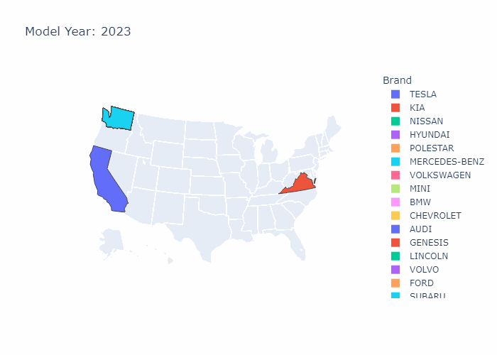

# PYTHON: ELECTRIC VEHICLE ANALYSIS 

## PROJECT OVERVIEW

With growing awareness of transportation's environmental impact, electric cars are seen as a promising solution to reduce carbon emissions and support sustainability. However, their adoption remains limited due to challenges like high costs, short driving range, and inadequate charging infrastructure. To boost their widespread use, it's important to assess the current electric car market and pinpoint areas for improvement. This study examines a dataset on electric vehicles to gain insights and offer recommendations for advocacy groups to support the adoption of electric cars.
 
 

**Dataset Information**

The dataset features Battery Electric Vehicles (BEVs) and Plug-in Hybrid Electric Vehicles (PHEVs) registered with the Washington State Department of Licensing (DOL). It includes 112,634 rows with 17 variables, each detailed below:

1.	**VIN (1-10)**: First 10 characters of the unique Vehicle Identification Number (VIN).
2.	**County**: Name of the county where the vehicle is registered or located.
3.	**City**: City where the vehicle is registered or located.
4.	**State**: U.S. state abbreviation where the vehicle is registered.
5.	**Postal Code**: ZIP code of the vehicle's registration or location.
6.	**Model Year**: Year the vehicle model was manufactured.
7.	**Make**: Manufacturer or brand of the vehicle (e.g., TOYOTA, CHEVROLET).
8.	**Model**: Specific model name of the vehicle (e.g., RAV4 PRIME, VOLT).
9.	**Electric Vehicle Type**: Type of electric vehicle (BEV or PHEV).
10.	**CAFV Eligibility**: Indicates if the vehicle qualifies as a clean alternative fuel vehicle.
11.	**Electric Range**: Distance the vehicle can travel on electric power alone (in miles).
12.	**Base MSRP**: Manufacturer’s Suggested Retail Price (excluding options or fees).
13.	**Legislative District**: Legislative district where the vehicle is registered.
14.	**DOL Vehicle ID**: Unique identifier for the vehicle from the Department of Licensing.
15.	**Vehicle Location**: Geographical coordinates (longitude and latitude) of the vehicle.
16.	**Electric Utility**: Name of the utility company providing power to the vehicle.
17.	**2020 Census Tract**: Census tract from the 2020 U.S. Census where the vehicle is located.

[Dataset Link](https://www.kaggle.com/datasets/utkarshx27/electric-vehicle-population-data)

 

## STEPS
 

**Data Collection**
  - Imported libraries, facilitating data exploration, manipulation, and visualization in Python, ideal for analytical tasks.
  - The dataset was imported from a Excel file into a dataframe using Python in GoogleColab.
 

**Data Exploration**

Conducted In Depth Exploratory Data Analysis Including Data Cleaning, Univariate and Bivariate Analysis.
- Data Overview
- Data Pre-processing
- Data Analysis 
    - Univariate & Bivariate
    - Choropleth (Plotly)

      ****
    - Racing Bar Plot 

      ****
 

**Conclusion**

Key Insights on:
- Recent Trends in Electric Vehicles
- Dominance of Tesla
- Range and Pricing Characteristics
- Electric Utility Providers
- Diversity in EV Types and Features

---
 

Please check out the **[Full Report](ElectricVehicles_Analysis.pdf)** for Further Explanation! 
\
Your Thoughts and Feedback are highly appreciated! :smile: 
